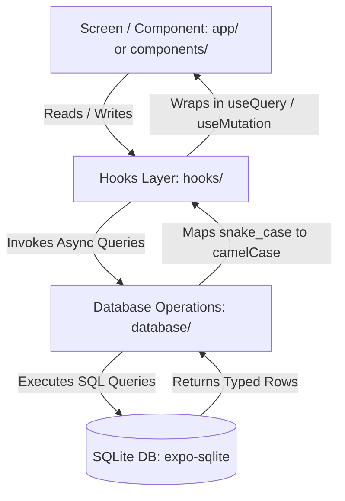
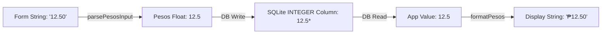

# CONTEXT.md — SariSari Project Context

**Last Updated:** 2026-06-26

> This document provides high-level project context, architecture layouts, database schemas, and coding conventions for both human developers and AI assistants. Keep it updated as the project evolves.

---

## 1. Project Overview

SariSari is an **offline-first** mobile application designed for Filipino sari-sari store owners to manage their retail business without internet access. It solves three core operational jobs:

1. **Inventory Management** — Products, categories, and stock levels with audit trails.
2. **Sales POS** — A fast checkout interface at the counter.
3. **Utang Ledger** — Customer (_suki_ profiles) credit and loan tracking with a running balance.

### Technology Stack

| Layer              | Technology           | Version / Notes                                                      |
| :----------------- | :------------------- | :------------------------------------------------------------------- |
| **Framework**      | Expo SDK             | Managed workflow, EAS Build ready (SDK 54)                           |
| **Runtime**        | React Native / React | React Native 0.81, React 19 (Fabric New Architecture)                |
| **Routing**        | Expo Router          | File-based routing (Expo Router 6) under `app/`                      |
| **Local Database** | Expo SQLite          | Single connection database (`expo-sqlite` 16)                        |
| **Styling**        | NativeWind           | Tailwind CSS configuration v4 (`className`)                          |
| **Server State**   | TanStack Query       | Query caching & SQLite async function wrappers (v5)                  |
| **Client State**   | Zustand              | UI-only states (e.g. filters, sheets) (v5). **No business caching.** |
| **Forms**          | React Hook Form      | Dynamic forms with validation (v7)                                   |
| **Animation**      | Moti / Reanimated    | Reanimated 4, Moti for declarative micro-animations                  |
| **Test Database**  | `better-sqlite3`     | Used in Jest to mock the SQLite runtime in-memory                    |

---

## 2. Directory Layout & Landmarking

The project enforces a strict **layered architecture**. The following landmark directories partition the codebase:

```folder
SariSari/
├── app/                  # Routes (expo-router). URL path maps to folder names.
│   ├── (tabs)/           # Bottom tab screens (inventory, sell, utang, reports)
│   ├── (edit-forms)/     # Modals and create/edit forms
│   └── onboarding/       # Onboarding screens for first-time setup
├── components/           # Presentational components (cross-screen UI elements)
├── database/             # SQLite CRUD functions. Pure async queries, no classes.
│   └── migrations.ts     # SQLite database migrations runner
├── hooks/                # TanStack Query query/mutation hook wrappers mirroring database/
├── stores/               # Zustand stores (strictly for transient UI/layout states)
├── constants/            # Enum structures, theme options, static strings
├── configs/              # Startup scripts, database connections, environment flags
├── lib/                  # Core standalone logic and algorithms (e.g. money parser)
├── types/                # Shared TypeScript models and interfaces
├── utils/                # General formatting utilities and timezone adapters
└── tests/                # Jest testing suites mirroring app directories
```

---

## 3. System Architecture & Layering Rules

All business data flows unidirectionally from the database up to the UI. Direct data access bypasses are strictly forbidden to ensure cache consistency and query invalidation.



### Invariants

1. **No direct DB calls from screens:** A screen must never import database query functions directly. It must always read/write through a custom TanStack Query hook in `hooks/`.
2. **No business data in Zustand:** Zustand stores in `stores/` are strictly for UI configuration (e.g., drawer open state, search queries). Data queried from the database must reside in the TanStack Query cache.
3. **Domain boundaries:** Functions in `database/` must never import from `hooks/`, `stores/`, or `app/`.

---

## 4. Domain & Database Schema

The local SQLite database consists of 9 normalized tables. Relational consistency and audit logs are maintained through SQLite transactions.

### Entity Relationship Diagram (ERD)

```erd
  +------------+             +--------------+             +------------------------+
  | categories |             |   products   |             | inventory_transactions |
  +------------+             +--------------+             +------------------------+
  | id (PK)    |             | id (PK)      |             | id (PK)                |
  | name (UQ)  |-- (category)| category     |             | product_id (FK) -------+
  +------------+             | name, sku... |             | type, quantity, note...|
                             +--------------+             +------------------------+
                                    |
                                    +--------------------+
                                                         |
  +------------+             +--------------+            |    +------------------+
  | customers  |             |    sales     |            |    |    sale_items    |
  +------------+             +--------------+            |    +------------------+
  | id (PK)    |             | id (PK)      |            |    | id (PK)          |
  | name       |--+          | total        |            |    | sale_id (FK)-----+
  | phone...   |  |          | payment_type |            |    | product_id (FK)-+
  +------------+  |          | timestamp... |            |    | quantity, price  |
        |         |          +--------------+            |    +------------------+
        |         |                 |                    |
        |         +-----------------+                    |
        |                           |                    |
        | (customer_id)             | (customer_credit_id)
        |                           |
        v                           v
  +---------------------+    +--------------------+
  | credit_transactions |    |      payments      |
  +---------------------+    +--------------------+
  | id (PK) <-----------+----+ credit_txn_id (FK) |
  | customer_id (FK)    |    | customer_id (FK)   |
  | amount, status...   |    | amount, date...    |
  +---------------------+    +--------------------+
        ^                           ^
        |                           |
        |      +--------------------+
        |      |
  +---------------------+
  | payment_allocations |
  +---------------------+
  | id (PK)             |
  | payment_id (FK)     |
  | credit_txn_id (FK)  |
  | amount              |
  +---------------------+
```

### Table Definitions

1. **`categories`**
   - Primary Key: `id INTEGER AUTOINCREMENT`
   - Fields: `name TEXT UNIQUE NOT NULL`, `created_at TEXT`, `updated_at TEXT`
   - Purpose: Groups products.

2. **`products`**
   - Primary Key: `id INTEGER AUTOINCREMENT`
   - Fields: `name TEXT NOT NULL`, `sku TEXT UNIQUE NOT NULL`, `price INTEGER NOT NULL`, `cost_price INTEGER`, `quantity INTEGER NOT NULL DEFAULT 0`, `category TEXT REFERENCES categories(name) ON DELETE SET NULL`
   - Purpose: Stores products and stock levels. `quantity` represents current inventory.

3. **`inventory_transactions`**
   - Primary Key: `id INTEGER AUTOINCREMENT`
   - Fields: `product_id INTEGER REFERENCES products(id) ON DELETE CASCADE`, `type TEXT CHECK(type IN ('restock', 'sale', 'damaged', 'adjustment'))`, `quantity INTEGER NOT NULL`, `note TEXT`, `adjustment_sign TEXT CHECK(adjustment_sign IN ('positive', 'negative'))`
   - Purpose: Audit log of all stock movements.

4. **`sales`**
   - Primary Key: `id INTEGER AUTOINCREMENT`
   - Fields: `total INTEGER NOT NULL`, `payment_type TEXT CHECK(payment_type IN ('cash', 'credit'))`, `customer_name TEXT`, `customer_credit_id INTEGER REFERENCES customers(id)`, `credit_transaction_id INTEGER REFERENCES credit_transactions(id) ON DELETE SET NULL`
   - Purpose: Transaction headers for sales.

5. **`sale_items`**
   - Primary Key: `id INTEGER AUTOINCREMENT`
   - Fields: `sale_id INTEGER REFERENCES sales(id) ON DELETE CASCADE`, `product_id INTEGER REFERENCES products(id)`, `quantity INTEGER NOT NULL`, `price INTEGER NOT NULL`
   - Purpose: Line items for individual sales.

6. **`customers`**
   - Primary Key: `id INTEGER AUTOINCREMENT`
   - Fields: `name TEXT NOT NULL`, `phone TEXT`, `address TEXT`, `notes TEXT`, `credit_limit INTEGER`
   - Purpose: Customer profiles (_suki_ profiles) for tracking debt.

7. **`credit_transactions`**
   - Primary Key: `id INTEGER AUTOINCREMENT`
   - Fields: `customer_id INTEGER REFERENCES customers(id) ON DELETE CASCADE`, `product_id INTEGER`, `product_name TEXT`, `quantity INTEGER`, `amount INTEGER NOT NULL`, `amount_paid INTEGER DEFAULT 0`, `status TEXT CHECK(status IN ('unpaid', 'partial', 'paid'))`
   - Purpose: Individual loans or credit sales issued to customers.

8. **`payments`**
   - Primary Key: `id INTEGER AUTOINCREMENT`
   - Fields: `customer_id INTEGER REFERENCES customers(id) ON DELETE CASCADE`, `credit_transaction_id INTEGER REFERENCES credit_transactions(id) ON DELETE SET NULL`, `amount INTEGER NOT NULL`, `payment_method TEXT`
   - Purpose: Payments made by customers to settle debt.

9. **`payment_allocations`**
   - Primary Key: `id INTEGER AUTOINCREMENT`
   - Fields: `payment_id INTEGER REFERENCES payments(id) ON DELETE CASCADE`, `credit_transaction_id INTEGER REFERENCES credit_transactions(id) ON DELETE CASCADE`, `amount INTEGER NOT NULL`
   - Purpose: Links a payment to the specific credits it settled. Allows reversing allocations if a payment is deleted.

---

## 5. Architectural Invariants & Guardrails

### SQLite Write Transactions

All database operations modifying multiple tables must be wrapped in a transaction block. SQLite locks the file-level database on write; partial writes corrupt relational consistency.

- Use `db.withTransactionAsync(async () => { ... })` for nested operations (e.g. updating product quantity alongside appending to `inventory_transactions`).
- Explicitly execute transactional statements in raw SQL strings where needed (e.g. `BEGIN TRANSACTION;`, `COMMIT;`, `ROLLBACK;`) to serialize POS sales and avoid locking errors.

### The Utang (Credit) Invariants

1. **Outstanding Balance Calculation:** A customer's outstanding balance is never stored as a denormalized column. It is computed dynamically via `SUM(amount - amount_paid)` from unpaid/partially paid transactions. This prevents sync drift.
2. **FIFO Allocation:** Payments are automatically allocated against a customer's oldest outstanding credit transactions (First-In, First-Out).
3. **Reversible Payments:** Deleting a payment uses `payment_allocations` to reverse allocations, reverting affected credit transactions back to `unpaid` or `partial`.

### Hard Offline-First

No remote calls (e.g. `fetch()`, REST APIs) are allowed inside core flows (Inventory, POS, Utang, Reports). The database connection must be shared as a single instance initialized in `configs/sqlite.ts` to prevent locking crashes (`SQLITE_BUSY`).

---

## 6. The Money Pipeline & Numeric Types

To prevent floating-point inaccuracies from accumulating (e.g., `0.1 + 0.2 === 0.30000000000000004`), SariSari isolates currency math:



### The Code-vs-Database Scaling Variance (Crucial Context)

- **In the Database:** Relational database schemas and unit tests represent money in **centavos** (multiplied by 100). For example, `MOCK_PRODUCTS` price is `2500` representing ₱25.00, and database unit tests assert credit values as `1000` representing ₱10.00.
- **In JavaScript/TypeScript:** App states, forms, and formatting helpers handle money as **pesos** (a floating-point number, e.g., `12.5` representing ₱12.50).
- **SQLite Dynamic Affinity:** Since SQLite columns are declared as `INTEGER` but typing is dynamic, SQLite allows and stores the float `12.5` directly during live app operations. Both developers and AI assistants must pay attention to this scaling difference when mocking tests vs. writing frontend form mutations.

### Money Functions (`lib/money.ts`)

- `parsePesosInput(input: string): Pesos` — Cleans formatting characters and rounds value to 2 decimal places. Returns a branded `Pesos` float.
- `tryParsePesosInput(input: string): Pesos` — Safe wrapper returning `0` on invalid inputs.
- `formatPesos(value: number): string` — Converts number to Philippine Peso display string (e.g. `12.5` → `"₱12.50"`).
- `formatPesosCompact(value: number): string` — Abbreviates large values (e.g. `1500` → `"₱1.5k"`).

---

## 7. Development & Verification Commands

Use the following commands inside PowerShell or Command Prompt at the project root folder:

- **Start Expo Development Server:**

  ```bash
  npx expo start
  ```

  _(Press `a` for Android Emulator, `i` for iOS Simulator, or `w` for Web)_

- **Build App Binaries (Development Build):**

  ```bash
  npx expo run:android
  npx expo run:ios
  ```

- **Linting:**

  ```bash
  npx expo lint
  ```

- **Run Unit/Integration Tests:**

  ```bash
  pnpm test
  ```

- **Trigger Production Build via Expo Application Services (EAS):**

  ```bash
  eas build --platform android
  ```

---

## 8. Testing Strategy

- **Framework:** Jest.
- **Database Mocking:** Tests replace `expo-sqlite` with `better-sqlite3` executing on an in-memory database.
- **Isolation:** Use `resetMockDb()` in `beforeAll` / `beforeEach` to wipe states.
- **Verification:** Write unit tests for new DB operations under `tests/database/` and UI component behaviors under `tests/components/`.

---

## 9. Known Gaps & Constraints

1. **No Cloud Sync:** All data resides strictly in local SQLite. Clearing app storage or uninstalling the app permanently deletes all store data.
2. **Date Storage:** Dates are stored as ISO-8601 strings in local time or UTC (`YYYY-MM-DD HH:MM:SS`). Beware of timezone conversions when writing reports.
3. **Database Affinity Coercion:** Coercion behaves differently on `better-sqlite3` (strict type conversion on table inserts) compared to live React Native `expo-sqlite` (which preserves real float numbers). Ensure tests mock inputs accurately matching runtime behavior.
