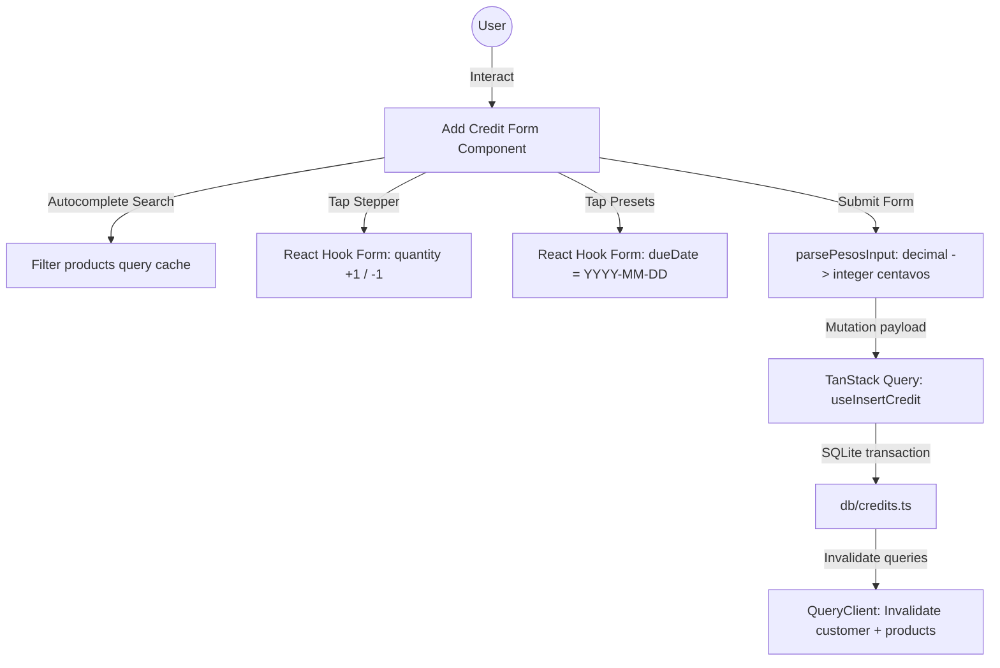

# Design Spec: Add Credit Redesign

* **Date:** 2026-06-25
* **Author:** Antigravity AI
* **Status:** Draft (Approved by User)
* **Target File:** [app/(edit-forms)/add-credit/[id].tsx](file:///C:/Users/giomj/OneDrive/Desktop/SariSari/app/%28edit-forms%29/add-credit/%5Bid%5D.tsx)

---

## 1. Objective & Context
The current **Add Credit** screen (`app/(edit-forms)/add-credit/[id].tsx`) features off-brand hardcoded purple colors (e.g., `#2E073F`, `#7A1CAC`) and lacks optimized counter-POS features (such as item filtering, due date shortcuts, and quantity steppers).

This redesign updates the screen to:
1. **Cozy Analog Ledger Theme:** Standardize styling to match the SariSari receipt design system using custom paper colors, deep cinnamon text, and dotted dividing lines.
2. **One-Handed Mobile UX:** Introduce a local searchable autocomplete dropdown for items, a tactile quantity stepper, and quick due date preset chips to reduce keyboard time.
3. **Preserve Database & Math Rules:** Maintain strict integer-based peso currency parsing and transaction-safe queries as outlined in the `AGENTS.md` guidelines.

---

## 2. Requirements & User Experience

### A. Layout Structure (Ledger Ticket)
* **Background:** The screen outer container will use `bg-background` (`paper-200`, `#EFE6D2`) for consistency.
* **Ticket Paper Sheet:** The central form is wrapped in a container styling:
  `bg-paper-50 border border-paper-300 rounded-xl p-4 shadow-paper paper-texture`
* **Section Partitioning:** Sections (Customer Header, Product Picker, Stepper/Price, Due Date, and Grand Total) will be divided by custom dotted line utilities:
  `className="divider-dotted my-4 border-t border-dashed border-ink-300"`
* **Typography:** Core headers use `cinnamon-500` (`#623418`). Sub-headings and form field titles use `label-caps text-ink-500`.

### B. Interactive Controls
1. **Searchable Product Autocomplete Dropdown:**
   * Tapping the "Product Name" input displays suggestions filtered from the query cache (`getAllProductsQuery`).
   * Suggestion dropdown is styled as a clean card matching the paper theme: `bg-white border border-paper-300 rounded-lg shadow-raised`.
   * Selecting a product fills the form's `productName` and `amount` (unit price), shows the stock warning, and hides suggestions.
2. **Tactile Quantity Stepper:**
   * Brackets the quantity input with `-` and `+` touchable areas.
   * Modifies the react-hook-form value dynamically using `setValue`.
   * Minimum value clamped at `1`.
3. **Due Date Preset Chips:**
   * Pre-calculates dates relative to `Date.now()` and displays them as selection chips:
     * **No Limit:** Sets value to `''`.
     * **1 Wk:** Computes current time + 7 days.
     * **2 Wks:** Computes current time + 14 days.
     * **1 Mo:** Computes current time + 30 days.
   * Formats selections into the standard database date format `YYYY-MM-DD`.

---

## 3. Data Flow & Security Guards

### A. Integrity Rules
* **No Floats:** Values are parsed using `@/lib/money`'s `parsePesosInput` and displayed with `formatPesos` to avoid standard JS float error propagation.
* **Transactions:** The `useInsertCredit` mutation writes to SQLite via `db.withTransactionAsync` wrapped db functions in `db/credits.ts` (enforces ledger balance invariants).

### B. State Management Diagram

---

## 4. Design Tokens & Styling Cheat Sheet

We will use the following Tailwind variables defined in `global.css`:

* **Layout Background:** `bg-background` (`#EFE6D2`)
* **Receipt Ticket Background:** `bg-paper-50` (`#FBF7EE`) with `paper-texture`
* **Header / Primary Text:** `text-cinnamon-500` (`#623418`)
* **Supporting Text / Capitalized Labels:** `text-ink-500` (`#564E45`) with `label-caps`
* **Input Background:** `bg-paper-100` (`#F6F0E2`) with `border-paper-300`
* **Borders / Separators:** `border-paper-300` (`#E5D8BC`)
* **Dotted Dividers:** `divider-dotted`
* **Primary Highlight / Accent Action:** `bg-persimmon-500` (`#E85A1F`)
* **Click Animations:** `press-scale` on all Pressable buttons

---

## 5. Verification & Quality Gates
* **Offline-First Verification:** Test validation, inputs, presets, and mutations under Airplane Mode to confirm zero remote dependencies.
* **Database Math Verification:** Verify that transaction entry saves integers correctly and does not write float decimals to the SQLite tables.
* **UX Stepper/Chips Verification:** Ensure values update immediately in react-hook-form state and reflect in the calculated grand total card.
