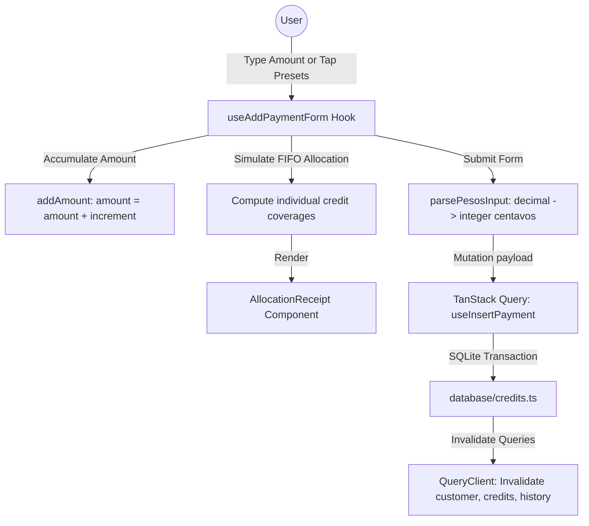

# Design Spec: Add Payment Redesign

- **Date:** 2026-06-25
- **Author:** Antigravity AI
- **Status:** Draft (Pending Review)
- **Target File:** [app/(edit-forms)/add-payment/[id].tsx](file:///C:/Users/giomj/OneDrive/Desktop/SariSari/app/%28edit-forms%29/add-payment/%5Bid%5D.tsx)

---

## 1. Objective & Context

The current **Add Payment** screen (`app/(edit-forms)/add-payment/[id].tsx`) uses off-brand colors (e.g., `#2E073F`, `#7A1CAC`, `#6ea93d`) and lacks Optimized Counter-POS components such as quick preset chips and real-time visual credit settlement allocation.

This redesign updates the screen to:

1. **Modular Consistency:** Extract forms, query management, and math operations into modular components and a custom hook under `components/utang/add-payment/` to match the design pattern in `add-credit`.
2. **Cozy Analog Ledger Theme:** Apply the warm parchment and cinnamon colors of the SariSari receipt design system.
3. **One-Handed Mobile POS QoL:** Introduce additive preset payment chips (`+₱20`, `+₱50`, `+₱100`, `+₱500`), a `Pay Full` shortcut, a `Clear` button, and a live-updating visual paper-receipt FIFO credit allocation list.

---

## 2. Requirements & User Experience

### A. Layout Structure (Analog Receipt Roll)

- **Outer Background:** The screen outer container will use `bg-background` (`paper-200`, `#EFE6D2`) for consistency.
- **Card Styling:** Form sections are contained in modern, clean cards matching the paper theme:
  `bg-paper-50 border border-paper-300 rounded-xl p-4 shadow-paper`
- **Dotted Dividers:** Sections will be separated using the custom dotted line style:
  `className="border-t border-dashed border-ink-300 my-4"`
- **Typography:** Titles use `text-cinnamon-500` (`#623418`), and labels use `text-ink-500` (`#564E45`) with `variant="semibold"`.

### B. Interactive Controls

1. **Large Currency Input Box:**
   - Visual focus area displaying `₱` and the current payment amount.
   - Text entry uses `decimal-pad` keyboard layout.
2. **Additive Quick-Pay Chips:**
   - Tapping `+₱20`, `+₱50`, `+₱100`, or `+₱500` increments the payment amount additively (e.g., tap `+₱100` twice to input `₱200`).
   - `Pay Full` sets the input exactly to the suki's outstanding balance.
   - `Clear` sets the input to an empty string.
3. **Integrated Allocation Receipt:**
   - An elegant visual list simulating real-time FIFO allocation:
     - Iterates through unpaid credits oldest-to-newest.
     - Fully Covered Credits: Styled in green with a checkmark (`text-semantic-success`).
     - Partially Covered Credits: Styled in orange showing the applied portion (`text-semantic-warning`).
     - Remaining Unpaid: Styled in standard text (`text-ink-400`).
     - Live Remaining Balance: Displays the remaining total debt of the suki (`customer.outstanding_balance - amount`). If it reaches 0, displays a green success notice: *"This payment will clear all outstanding balance"*.
4. **Payment Method & Notes:**
   - Styled selection chips for `Cash`, `Bank` (bank_transfer), and `Other`.
   - Simple, clean multiline Text Area for notes.

---

## 3. Data Flow & Math Rules

### A. Invariants

- **Pesos Integer Math:** Values entered are processed as centavos. `parsePesosInput` and `tryParsePesosInput` from `@/lib/money` will be used to safely transition from decimal string inputs to integer values.
- **SQLite Database Integration:** Uses TanStack Query `useInsertPayment` mutation. The database-level write handles the FIFO allocation and rolls back via `withTransactionAsync` in case of failure.

### B. State Management Diagram

---

## 4. Proposed File Layout

We will create the following files in `components/utang/add-payment/`:

* **`useAddPaymentForm.ts`**: Form handler, presets operations, queries, and submission mutation.
* **`AddPaymentHeader.tsx`**: Customer details card (Outstanding Balance, Suki Tag).
* **`PaymentAmountCard.tsx`**: Large numeric input, preset chips (`+₱20`, etc.), remaining balance alert.
* **`AllocationReceipt.tsx`**: Live visual receipt showing FIFO debt distribution.
* **`PaymentMethodSelector.tsx`**: Cash/Bank/Other toggle buttons.
* **`NotesField.tsx`**: Notes textarea.
* **`SubmitButton.tsx`**: Full-width record button with pending status indicator.
* **`index.ts`**: Clean entry exports.

The route file `app/(edit-forms)/add-payment/[id].tsx` will be refactored into a thin coordinator.

---

## 5. Verification & Quality Gates

- **Offline-First Verification:** Check that typing values, using presets, and submitting mutation works flawlessly in Airplane Mode (fully local).
- **Database Math Integrity:** Verify that database writes are integers (no float values).
- **FIFO Visual Match:** Verify that the simulated receipt allocation correctly matches the database state after a payment transaction completes.
