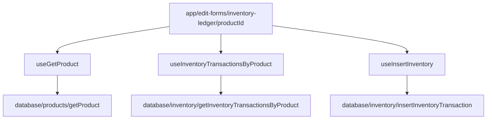

# Spec: Inventory Ledger UI/UX Redesign

- **Status**: Draft
- **Date**: 2026-06-26
- **Author**: Antigravity
- **Target Route**: [app/(edit-forms)/inventory-ledger/[productId].tsx](file:///C:/Users/giomj/OneDrive/Desktop/SariSari/app/(edit-forms)/inventory-ledger/[productId].tsx)
- **Component Folder**: [components/inventory/ledger/](file:///C:/Users/giomj/OneDrive/Desktop/SariSari/components/inventory/ledger)

---

## 1. Objective & User Story
As a sari-sari store owner, I want to quickly view the transaction history of any product, see key summaries of stock activity (restocks, sales, damages), and instantly record adjustments or additions without navigating away, so that managing inventory is friction-free and fast.

### Goals:
- **Professional & Beautiful Look**: Modern mobile layout using native elements, pleasing color contrast, clear visual hierarchy, and polished spacing.
- **High QoL (Quality of Life)**: Direct inline logging of new transactions from the ledger page, removing the need to navigate back to "Adjust Stock" on the main inventory screen.
- **Separation of Concerns**: Split the single monolithic screen into cleanly bounded, reusable modular components under the `components/inventory/ledger/` directory.
- **Offline-First & Robust SQLite**: All database operations must work perfectly offline with atomic transaction protection.

---

## 2. Component Architecture
To ensure high maintainability and testability, we will modularize the screen using the following components under `components/inventory/ledger/`:

```
components/inventory/ledger/
├── LedgerStats.tsx          - Visual card grid displaying Restocked, Sold, and Damaged count over 30 days.
├── LedgerToolbar.tsx        - Text search input and filter chips for transaction types.
├── LedgerList.tsx           - Interactive list/timeline rendering individual ledger entries with Moti layout animations.
├── LogTransactionForm.tsx   - Slide-in form container (using react-hook-form) to input Restock, Damaged, or Adjustment.
└── index.ts                 - Public entry point exporting the components.
```

### Component Details:
1. **[LedgerStats.tsx](file:///C:/Users/giomj/OneDrive/Desktop/SariSari/components/inventory/ledger/LedgerStats.tsx)**:
   - Accepts transaction history array as prop.
   - Computes sums for the last 30 days:
     - `Restocked`: SUM(quantity) where type = 'restock' or adjustment_sign = 'positive'.
     - `Sales`: SUM(quantity) where type = 'sale'.
     - `Damaged`: SUM(quantity) where type = 'damaged'.
   - Displays them in three cards with thematic backgrounds matching the status: sage green for restock, primary teal for sales, semantic red/pink for damages.

2. **[LedgerToolbar.tsx](file:///C:/Users/giomj/OneDrive/Desktop/SariSari/components/inventory/ledger/LedgerToolbar.tsx)**:
   - Props: `searchQuery`, `setSearchQuery`, `selectedTypeFilter`, `setSelectedTypeFilter`.
   - Renders a clean search box and scrollable row of status pill chips (All, Restock, Sale, Damaged, Adjustment).

3. **[LedgerList.tsx](file:///C:/Users/giomj/OneDrive/Desktop/SariSari/components/inventory/ledger/LedgerList.tsx)**:
   - Props: `transactions: InventoryTransaction[]`.
   - Filters transactions by search query and type filter.
   - Renders a `FlatList` or scrollable list.
   - Items animate using Moti/Reanimated for smooth transition states.
   - Displays clear quantity displays (+Qty in green, -Qty in red), formatted timestamps, and note descriptions (or stylized "No description provided").

4. **[LogTransactionForm.tsx](file:///C:/Users/giomj/OneDrive/Desktop/SariSari/components/inventory/ledger/LogTransactionForm.tsx)**:
   - Props: `productId`, `onSuccessCallback`.
   - Integrates `react-hook-form` to collect transaction input.
   - Fields:
     - `type`: Select restock, damaged, or adjustment.
     - `adjustment_sign`: If type is adjustment, toggle between `positive` (+) and `negative` (-).
     - `quantity`: Positive integer, enforced via input validation.
     - `note`: Text description.
   - Triggers `useInsertInventory` mutation.
   - Validates quantity must be > 0 and cannot result in negative stock.

---

## 3. Data Flow & SQLite Operations
Following the layering rule, the ledger screen and its sub-components will never query the database directly. They will consume TanStack Query hooks:



### Mutating State:
- `insertInventoryTransaction` wraps updates inside `db.withTransactionAsync`.
- Invalidation flow:
  1. On success, `useInsertInventory` invalidates `['products']` and `['inventory']` query keys.
  2. This triggers the screen to refetch the product detail (which updates current stock in the header) and the transaction list (which updates the stats cards and timeline).

---

## 4. Visual Styles & Styling Guidelines
We will styling our components using NativeWind v4 utility classes:
- **Header theme**: cinnamon-500 matching the current SariSari edit-forms style.
- **Card container**: `bg-paper-50 border border-ink-100 rounded-2xl p-4`.
- **Text colors**:
  - Restock/Increase: `text-sage-700` / `#2F5C3E`
  - Sale/Damage/Decrease: `text-semantic-danger` / `#C22D2D`
  - Metadata: `text-ink-400`
- **Animations**: Slide up form panel from the bottom with a backdrop overlay, and enter-transition the items.

---

## 5. Security & Edge Cases
- **Negative Stock Protection**: The database function `insertInventoryTransaction` validates that the final stock `newQuantity = currentQuantity + quantityChange` is never `< 0`. If so, it throws an error that is handled by the mutation and displayed as a Toast alert.
- **Input Validation**: `quantity` field will reject symbols, floating points, and zero.
- **Offline Reliability**: Works fully offline. Since all SQL relies on local DB queries, there are no remote network calls.
