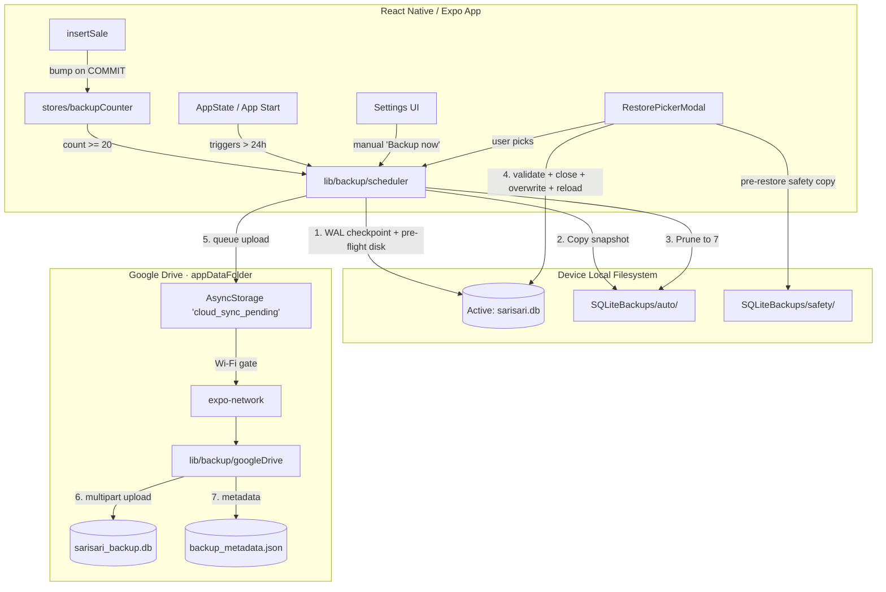

# Design Specification: Hybrid Automated Cloud & Local Snapshots

This document specifies the design for the automated data backup and restore system in SariSari. The system ensures offline-first reliability, opt-in Google Drive cloud replication, and automated rolling local snapshots. It supersedes the partial Share Sheet–based flow shipped in commit `3343594`.

---

## 1. Overview & Objectives

SariSari is an offline-first app. Since data is stored locally on the device (SQLite), a lost, stolen, or damaged device means permanent data loss. This specification outlines a hybrid solution combining:

- Automated rolling local backups (always on)
- Opt-in personal Google Drive sync (Wi-Fi preferred)
- An integrity-validated restore path with safety copies

The previous `lib/backup.ts` (Share Sheet export + DocumentPicker restore) is **replaced** by this system in v1.0.1. There is no parallel flow.

### Key Objectives

- **Zero-Effort Local Backups:** Rolling 7-snapshot history on device, taken automatically after 20 sales or 24 hours, whichever comes first.
- **Opt-In Cloud Replication:** Google Drive `appDataFolder` (hidden) via OAuth; user can unlink at any time.
- **Corruption Prevention:** Strict SQLite connection management, magic-header + `PRAGMA integrity_check` validation, safety copies before every restore, rollback on partial-write failure.
- **Offline-First:** No network call is ever in the critical path of a sale. Cloud sync is best-effort with an offline queue.

---

## 2. System Architecture & Components



### Module layout

```
lib/backup/
  snapshots.ts        // create, list, prune local rolling snapshots + safety copies
  integrity.ts        // SQLite magic header + read-only integrity_check
  metadata.ts         // build/read {updatedAt, storeName, ownerName, salesCount, appVersion}
  restore.ts          // validate, safety copy, close, overwrite, reload
  googleDrive.ts      // OAuth (PKCE), upload, list, download (bare fetch)
  syncQueue.ts        // pending-flag in AsyncStorage; transitions on Wi-Fi
  scheduler.ts        // orchestrates triggers; reads counter & lastBackupTs
  types.ts            // BackupError union, Snapshot type, Metadata type
  index.ts            // public surface: runStartupChecks, performBackup, performRestore

hooks/useBackup.tsx
  // useBackupStatus, useLocalSnapshots, useCloudBackups,
  // useLinkGoogleDrive, useUnlinkGoogleDrive, useBackupNow,
  // useRestoreFromSnapshot, useRestoreFromCloud, useRestorePicker

stores/backupCounter.ts
  // count: number; bump(); reset();  (Zustand)

database/sales.ts (modified)
  // after COMMIT in insertSale, call useBackupCounter.getState().bump()

app/_layout.tsx (modified)
  // useEffect: call scheduler.runStartupChecks() once on mount
  // useEffect: subscribe to backupCounter.count for 20-sale trigger
  // AppState listener for Wi-Fi-gated sync retries

components/settings/backup/
  CloudBackupSection.tsx
  LocalSnapshotsSection.tsx
  RestorePickerModal.tsx
  CloudNewerBanner.tsx
  RestoreConfirmDialog.tsx
  index.ts
```

The layering rule (AGENTS.md §3) is preserved:
- `lib/backup/` never imports from `app/`, `components/`, `hooks/`, or `stores/` (except `stores/backupCounter` for the bump wiring — justified below).
- `hooks/useBackup.tsx` is the only consumer of `lib/backup/`.
- `stores/backupCounter.ts` holds **only** the integer counter. No business data.
- The sale counter bump is done via the singleton import in `database/sales.ts` *after* COMMIT. This is the only stateful cross-layer call. Acceptable because (a) the counter is UI-side Zustand, not a cache, and (b) the bump is fire-and-forget; a failure cannot affect the sale.

---

## 3. Local Rolling Snapshots

### 3.1. Directory layout

```
{FileSystem.documentDirectory}SQLiteBackups/
  ├── auto/                          ← rolling 7 snapshots (auto-pruned)
  │     sarisari_snapshot_2026-06-27_14-02-31-421.db
  │     sarisari_snapshot_2026-06-26_14-00-08-117.db
  │     ...
  └── safety/                        ← pre-restore copies (never pruned)
        sarisari_safety_2026-06-27_15-30-22-005.db
        ...
```

`auto/` is the rolling history. `safety/` is for rollback. The two never share a directory, so the rolling prune logic is mechanically incapable of touching safety copies.

Both subdirectories are created on first write via `FileSystem.makeDirectoryAsync(path, { intermediates: true })` if missing. `ensureBackupDirs()` runs at app start inside `runStartupChecks()` so the directories exist before the first snapshot.

### 3.2. Filename format

`{prefix}_YYYY-MM-DD_HH-mm-ss-{ms3}.db` where `ms3` is the last three digits of `Date.now()` to avoid same-second collisions on rapid manual taps.

### 3.3. Pre-flight

Before every snapshot, the scheduler:

1. **Disk space check:** `freeBytes >= 5 × dbSize`. If not, throw `BackupError('insufficient_disk')` and surface a Toast.
2. **WAL checkpoint:** `await db.execAsync('PRAGMA wal_checkpoint(TRUNCATE);')`. A snapshot of an unflushed WAL is corrupt on restore. This step is **mandatory**.

### 3.4. Snapshot creation

```ts
async function performLocalSnapshot(): Promise<SnapshotResult> {
  await assertDiskSpace();
  await db.execAsync('PRAGMA wal_checkpoint(TRUNCATE);');

  const stamp = formatStamp();   // includes ms suffix
  const filename = `sarisari_snapshot_${stamp}.db`;
  const dest = `${AUTO_DIR}${filename}`;

  await FileSystem.copyAsync({ from: DB_PATH, to: dest });

  await pruneAutoSnapshots(keep = 7);

  await AsyncStorage.setItem('last_backup_at', String(Date.now()));
  backupCounter.getState().reset();

  return { path: dest, bytes: (await FileSystem.getInfoAsync(dest)).size, createdAt: Date.now() };
}
```

### 3.5. Rolling prune

```ts
async function pruneAutoSnapshots(keep: number) {
  const files = await FileSystem.readDirectoryAsync(AUTO_DIR);
  const snapshots = files.filter(f => f.startsWith('sarisari_snapshot_')).sort();  // ISO prefix sorts chronologically
  if (snapshots.length <= keep) return;
  const toDelete = snapshots.slice(0, snapshots.length - keep);
  for (const f of toDelete) {
    await FileSystem.deleteAsync(`${AUTO_DIR}${f}`, { idempotent: true });
  }
}
```

### 3.6. Triggers

| Trigger         | Condition                            | Source                              |
|-----------------|--------------------------------------|-------------------------------------|
| App start       | `now - lastBackupAt > 24h`           | `scheduler.runStartupChecks()`      |
| Sale milestone  | `backupCounter.count >= 20`          | `useEffect` in `RootLayout`         |
| Manual          | User taps "Backup now"               | `useBackupNow()` mutation           |
| Pre-restore     | Always, before any destructive write | `restore.ts` (saves to `safety/`)   |

The first three write to `auto/`. Pre-restore writes to `safety/`.

### 3.7. Last-backup timestamp

Persisted in AsyncStorage under `last_backup_at` (epoch ms, string). Read at app start. Updated after every successful snapshot. Cleared on unlink-Drive? **No** — local backups are independent of Drive. `last_backup_at` is the time of the last **local** snapshot, regardless of cloud state.

---

## 4. Google Drive Integration

### 4.1. Authentication

- **Library:** `expo-auth-session` + `expo-web-browser` + `expo-crypto` (PKCE). All installed at v1.0.0.
- **Scope:** `https://www.googleapis.com/auth/drive.appdata` only. The `appDataFolder` is hidden from the user's Drive UI.
- **Flow:** PKCE authorization code. Verifier generated via `crypto.randomUUID()`. Redirect URI derived from the app's `expo` scheme (`sarisari://`).
- **Token storage:** `expo-secure-store`.
  - `gdrive_access` → `{ accessToken, expiresAt }`
  - `gdrive_refresh` → `refreshToken`
- **Client ID:** read from `expo-constants` `extra.googleClientId`. Documented in README. (User must register their own OAuth client in Google Cloud Console.)

### 4.2. Cloud file layout

```
appDataFolder/
  ├── sarisari_backup.db          ← latest snapshot (overwritten on each sync)
  └── backup_metadata.json        ← small sidecar
```

The metadata file is fetched without downloading the DB, so the picker and the "cloud newer?" comparison are fast even on slow networks. **No history on cloud** — the 7-snapshot history is local-only. Cloud is "your latest known-good state."

### 4.3. Metadata format

```json
{
  "updatedAt": 1719481234000,
  "storeName": "Lina's Sari-Sari Store",
  "ownerName": "Lina Cruz",
  "salesCount": 1024,
  "appVersion": "1.0.1"
}
```

`storeName` and `ownerName` come from `useProfile().profile` (AsyncStorage, populated by onboarding). `salesCount` is the count from `useSales().data.length` (TanStack cache) at snapshot time. `appVersion` is `expo-constants` `expoConfig.version`.

### 4.4. Cloud upload flow

```
performCloudUpload():
  1. token = await ensureFreshToken()
  2. allowed = await shouldAttemptCloudUpload()    // see §4.6
  3. if !allowed:
       set 'cloud_sync_pending' = true
       return                                       // silent skip, retry on next Wi-Fi
  4. fileId = await googleDrive.findFile('sarisari_backup.db')
  5. metadata = buildMetadata(...)
  6. if fileId:
       await googleDrive.update(fileId, localSnapshot, metadata)
     else:
       await googleDrive.create(localSnapshot, metadata)
  7. set 'cloud_sync_pending' = false
  8. return
```

### 4.5. Drive API calls (bare `fetch`, no SDK)

| Op              | Endpoint                                                                          |
|-----------------|-----------------------------------------------------------------------------------|
| Find            | `GET /drive/v3/files?spaces=appDataFolder&q=name='sarisari_backup.db'`            |
| Create          | `POST /upload/drive/v3/files?uploadType=multipart`                                |
| Update          | `PATCH /upload/drive/v3/files/{fileId}?uploadType=media`                          |
| Download        | `GET /drive/v3/files/{fileId}?alt=media`                                          |
| Delete          | `DELETE /drive/v3/files/{fileId}`                                                 |

All requests carry `Authorization: Bearer <token>`. 401 → one refresh-and-retry. 429 → respect `Retry-After`. 5xx → throw, sync queue re-arms.

### 4.6. Network gating

```ts
async function shouldAttemptCloudUpload(): Promise<boolean> {
  const state = await Network.getNetworkStateAsync();
  if (!state.isConnected || !state.isInternetReachable) return false;
  if (state.type === 'wifi') return true;
  return (await AsyncStorage.getItem('cloud_allow_cellular')) === 'true';
}
```

`cloud_allow_cellular` defaults `false`. Toggle lives in Settings → Database → Advanced.

### 4.7. Sync queue state machine

```
                ┌──────────────┐
                │ IDLE         │  Drive linked, no pending
                └──────┬───────┘
                       │ snapshot completes OR
                       │   link toggled ON OR
                       │   AppState → active OR
                       │   Network → wifi
                       ▼
                ┌──────────────┐
                │ QUEUED       │  AsyncStorage['cloud_sync_pending']=true
                └──────┬───────┘
                       │ Wi-Fi + linked
                       ▼
                ┌──────────────┐
                │ UPLOADING    │  in-flight
                └──────┬───────┘
              success  │  failure
              ┌───────┴────────┐
              ▼                ▼
        ┌──────────┐     ┌──────────────┐
        │ IDLE     │     │ QUEUED       │ (retry next event)
        └──────────┘     └──────────────┘
```

Transitions are driven by three event sources: snapshot completion, `AppState` change, `Network.getNetworkStateAsync` polling (every 60s when foregrounded).

### 4.8. Unlinking

`useUnlinkGoogleDrive()`:
1. `DELETE` both Drive files (best-effort; ignore 404)
2. `SecureStore.deleteItemAsync('gdrive_access')` and `gdrive_refresh`
3. Set `cloud_linked = false` (AsyncStorage)
4. Remove `cloud_sync_pending`
5. **Local snapshots are untouched** — unlinking never destroys user data.

---

## 5. Restore Pipeline

The single funnel for every destructive restore. Pre-restore snapshot is mandatory.

```ts
async function restoreFromLocal(snapshotPath: string) {
  // 1. Validate source
  await integrity.validate(snapshotPath);   // throws → abort, no changes

  // 2. Take a safety copy (always, before any other write)
  await snapshotManager.createPreRestoreSafetyCopy();

  // 3. Close the live SQLite handle
  await db.closeAsync();

  // 4. Delete WAL/SHM sidecars (must happen AFTER close, BEFORE overwrite)
  await FileSystem.deleteAsync(`${DB_PATH}-wal`, { idempotent: true });
  await FileSystem.deleteAsync(`${DB_PATH}-shm`, { idempotent: true });

  // 5. Overwrite
  try {
    await FileSystem.copyAsync({ from: snapshotPath, to: DB_PATH });
  } catch (err) {
    // Rollback: copy the safety copy back
    const latestSafety = await snapshotManager.findLatestSafetyCopy();
    if (latestSafety) {
      await FileSystem.copyAsync({ from: latestSafety, to: DB_PATH });
    }
    throw err;
  }

  // 6. Verify overwrite landed cleanly
  await integrity.validate(DB_PATH);

  // 7. Reload
  try {
    await Updates.reloadAsync();
  } catch {
    Alert.alert('Restore complete — please reopen the app.');
  }
}
```

### Failure-mode table

| Failure                                 | Outcome                                                    |
|-----------------------------------------|------------------------------------------------------------|
| `integrity.validate` rejects source     | Nothing happens. User picks a different file.              |
| `db.closeAsync()` throws                | User sees error, aborts. No writes.                        |
| `copyAsync` to `DB_PATH` fails          | Safety copy is restored over the partial file.             |
| `Updates.reloadAsync` fails             | Safety copy exists; user reopens manually; data is sound.  |
| `reloadAsync` succeeds                  | App restarts on new DB, migrations run.                    |

### Restore from cloud

Identical pipeline, with a download step at the front:

```ts
async function restoreFromCloud(fileId: string) {
  const tmp = `${FileSystem.cacheDirectory}restore_${Date.now()}.db`;
  try {
    await googleDrive.download(fileId, tmp);
    await restoreFromLocal(tmp);
  } finally {
    await FileSystem.deleteAsync(tmp, { idempotent: true });
  }
}
```

Download lands in `cacheDirectory` which is OS-managed and cleanable.

### `db.closeAsync()` requirement

This spec assumes `expo-sqlite` 16 supports `closeAsync()`. The plan will verify this in the first implementation step. If unavailable, the fallback is: skip the close, delete WAL/SHM, copy, reload — the OS will flush WAL on the next read. This is **riskier** but works.

---

## 6. Integrity Check

```ts
async function validate(filePath: string): Promise<IntegrityResult> {
  // 1. Magic header
  const headerB64 = await FileSystem.readAsStringAsync(filePath, {
    encoding: 'base64', position: 0, length: 16,
  });
  if (headerB64 !== 'U1FMaXRlIGZvcm1hdCAzAA==') {
    return { ok: false, reason: 'bad_header' };
  }

  // 2. PRAGMA integrity_check via a separate read-only handle
  const probe = await SQLite.openDatabaseAsync(filePath);
  try {
    const rows = await probe.getAllAsync<{ integrity_check: string }>(
      'PRAGMA integrity_check'
    );
    const result = rows.map(r => r.integrity_check).join(' ');
    if (result !== 'ok') {
      return { ok: false, reason: 'integrity_check_failed', detail: result };
    }
  } finally {
    await probe.closeAsync();
  }

  // 3. Size sanity (≥ 1KB, ≤ 100MB) — guard against malicious/garbage files
  const info = await FileSystem.getInfoAsync(filePath);
  if (!info.exists || info.size < 1024 || info.size > 100 * 1024 * 1024) {
    return { ok: false, reason: 'unreasonable_size' };
  }

  return { ok: true };
}
```

The separate read-only handle is required because the live `db` handle is in WAL mode and would conflict with the probe. `closeAsync` on the probe is in a `finally` so an exception during integrity check still releases the handle.

---

## 7. Error Handling

Errors are **typed** and **non-fatal** for backups. A failed cloud sync never blocks a sale.

```ts
// lib/backup/types.ts
export type BackupError =
  | { kind: 'insufficient_disk';   freeBytes: number; needBytes: number; }
  | { kind: 'integrity_failed';    reason: 'bad_header' | 'integrity_check_failed' | 'unreasonable_size'; detail?: string; }
  | { kind: 'gdrive_auth';         status: 401 | 403; message: string; }
  | { kind: 'gdrive_quota';        status: 429; retryAfterSec: number; }
  | { kind: 'gdrive_server';       status: number; message: string; }
  | { kind: 'gdrive_network';      message: string; }
  | { kind: 'restore_in_progress'; message: string; }
  | { kind: 'unknown';             message: string; };
```

### Recovery table

| Error kind              | User-facing                                                  | Recovery                            |
|-------------------------|--------------------------------------------------------------|-------------------------------------|
| `insufficient_disk`     | Toast: "Need X MB free. Please free space."                  | User deletes other files            |
| `integrity_failed`      | Alert: "This backup is corrupt and can't be restored."       | Pick another                        |
| `gdrive_auth` (401/403) | Banner: "Google Drive link expired. Re-link to continue."    | Tap → re-runs OAuth                 |
| `gdrive_quota`          | Silent queue, retry after `Retry-After`                      | Auto                                |
| `gdrive_server/network` | Silent queue, retry next Wi-Fi                               | Auto                                |
| `restore_in_progress`   | Modal: "Restore already in progress."                        | Wait                                |
| Anything else           | Toast: "Backup failed: <reason>." + log to console           | Manual retry                        |

**What never throws across a sale:** `performLocalSnapshot()` failure does NOT cancel the sale. The sale is already committed to SQLite. The 20-sale counter just doesn't reset, so the next sale re-tries. The user's business is uninterrupted.

### Logging

`console.warn` for retryable errors. `console.error` for anything that hits a user alert. No third-party telemetry in v1 — SariSari is offline-first. A Sentry hook can be added in a future revision.

---

## 8. UI Surfaces

### Settings · Database (replaces the current "Backup" / "Restore" rows)

```
┌──────────────────────────────────────────────────┐
│ DATABASE                                         │
│ Automatic and on-demand backups of your store.   │
├──────────────────────────────────────────────────┤
│  ☁  Cloud backup                  [Linked ✓]    │
│     Google Drive · last synced 2h ago            │
│     ▸ 3 local snapshots pending upload           │
│                                                  │
│  [    Backup now    ]    [ Unlink ]              │
├──────────────────────────────────────────────────┤
│  📦  Local snapshots (7)                         │
│     Rolling backup history on this device.       │
│                                                  │
│     Today 14:02 · 1.2 MB               1.2 MB    │
│     Yesterday · 1.1 MB                  1.1 MB   │
│     Jun 25 · 1.1 MB                      1.1 MB  │
│     Jun 24 · 1.0 MB                      1.0 MB  │
│     ... (3 more)                                 │
│                                                  │
│  [    Restore from backup    ]                   │
├──────────────────────────────────────────────────┤
│  ⚙  Advanced                                     │
│     ☐ Use cellular data for cloud uploads        │
└──────────────────────────────────────────────────┘
```

### Restore picker modal

```
┌──────────────────────────────────────────────────┐
│  Restore from backup                       [×]   │
├──────────────────────────────────────────────────┤
│  [   Local (7)   ]   [   Cloud (1)   ]           │
│                                                  │
│  ● Today 14:02  ·  1.2 MB                        │
│    auto · 5 min ago                              │
│                                                  │
│  ○ Yesterday  ·  1.1 MB                          │
│    auto · 1 day ago                              │
│                                                  │
│  ○ Jun 25 14:00  ·  1.1 MB                       │
│    pre-restore safety copy                       │
│                                                  │
│  ...                                             │
│                                                  │
│  ⚠ Restoring replaces all current data.          │
│  A safety copy will be saved first.              │
│                                                  │
│  [      Restore selected snapshot      ]         │
└──────────────────────────────────────────────────┘
```

### Cloud-newer banner (on app start, dismissable)

```
┌──────────────────────────────────────────────────┐
│  ℹ  A newer backup is in Google Drive.           │
│     Cloud: 14:00 today · Local: 09:00 today      │
│     [   Restore from cloud   ]   [  Dismiss  ]   │
└──────────────────────────────────────────────────┘
```

### First-time Drive link consent

> "SariSari will upload your store data to your personal Google Drive, in a hidden app folder only this app can access. You can unlink at any time. Continue?"

### State coverage

| State                    | UI                                              |
|--------------------------|-------------------------------------------------|
| No snapshots yet         | "Your first backup will appear here."           |
| Linking Drive in progress| Spinner on the toggle row                        |
| Unlinked                 | Cloud backup row shows "Not linked. [Link]"      |
| Drive linked, no uploads | "Drive linked. Backups will sync on Wi-Fi."      |
| Sync pending, no Wi-Fi   | "3 snapshots waiting for Wi-Fi to upload."       |
| Auth expired             | "Google Drive link expired. [Re-link]"          |
| Restore in progress      | "Restoring… don't close the app."                |
| Restore failed           | Alert + automatic rollback via safety copy       |

### Accessibility

- All interactive rows have `accessibilityLabel` and `accessibilityRole="button"`.
- Pending state uses both icon and text (not color-only).
- Modal traps focus; Cancel reachable by Android back.

---

## 9. Testing Plan

### `tests/backup/snapshots.test.ts` (better-sqlite3 + temp dir)
- `pruneAutoSnapshots(keep=7)` deletes the N-7 oldest by filename
- Filename collision (same second) → ms suffix prevents it
- Disk-space pre-flight throws `insufficient_disk` when freeBytes < 5× dbBytes (mock `getFreeDiskStorageAsync`)
- Snapshot list query returns files sorted newest first
- Pre-restore safety copies live in `safety/` and are NOT touched by rolling prune

### `tests/backup/restore.test.ts`
- `integrity.validate` rejects: bad header, empty file, oversized file
- `integrity.validate` accepts: real better-sqlite3 file
- Restore pipeline: when `copyAsync` fails, safety copy is restored (mock copy to throw)
- Restore pipeline: pre-restore safety copy is always created before any destructive write
- WAL/SHM delete happens AFTER `db.closeAsync` and BEFORE copy
- `Updates.reloadAsync` is mocked — verified it's called last

### `tests/backup/metadata.test.ts`
- `buildMetadata({storeName, ownerName, salesCount, appVersion})` round-trips through JSON
- Read/write both work with realistic inputs

### `tests/backup/scheduler.test.ts`
- `runStartupChecks` with no `lastBackupAt` → triggers snapshot
- `runStartupChecks` with `lastBackupAt` 23h ago → does NOT trigger
- `runStartupChecks` with `lastBackupAt` 25h ago → triggers
- `runStartupChecks` with Drive linked + Wi-Fi + `cloud_sync_pending` → enqueues upload
- `runStartupChecks` with Drive linked + cellular (no override) → does NOT upload, stays queued
- 20-sale counter crossing threshold → snapshot runs, counter resets
- Counter reset to 0 after snapshot

### `tests/backup/syncQueue.test.ts`
- State machine: IDLE → QUEUED → UPLOADING → IDLE on success
- State machine: IDLE → QUEUED → UPLOADING → QUEUED on 5xx
- State machine: UPLOADING → QUEUED (with re-link prompt) on 401
- AsyncStorage key `cloud_sync_pending` toggles correctly

### What we do NOT test
- Real OAuth round-trip (expo-auth-session needs a native module)
- Real Google Drive HTTP calls (mocked via `global.fetch = jest.fn()`)
- AppState transitions (tested manually)
- `Updates.reloadAsync` behavior (tested manually; mocked in unit tests)

### Manual verification (per AGENTS.md "verify on simulator")
1. Fresh install → Drive unlinked → confirm "Link Google Drive" row appears
2. Link Drive → complete OAuth → confirm banner says "Backed up to Drive"
3. Turn off Wi-Fi → record 21 sales → confirm local snapshot created, "Pending cloud sync" indicator
4. Reconnect Wi-Fi → confirm cloud upload runs and pending clears
5. Airplane mode → record sales → confirm snapshots still created locally
6. Tap Restore → pick oldest snapshot → confirm destructive prompt → confirm app reloads with old data
7. Restore from cloud → confirm same
8. Tap "Unlink Drive" → confirm local snapshots remain, banner reverts to "Not linked"

---

## 10. Edge Cases & Error Handling

| Edge Case                    | Impact                                | Handling                                                                                                                       |
| :--------------------------- | :------------------------------------ | :------------------------------------------------------------------------------------------------------------------------------ |
| **No Disk Space**            | Backup crash or truncation            | Pre-flight disk space check cancels backup if free storage < 5× DB size. Toast alerts the user.                                |
| **Offline during trigger**   | Backup not synced to cloud            | `cloud_sync_pending = true` in AsyncStorage. Attempt upload on next Wi-Fi.                                                      |
| **Auth token expired**       | Cloud upload fails                    | `ensureFreshToken()` runs once and retries. If refresh fails, banner prompts user to re-link.                                   |
| **Partial write on restore** | Corrupt database on app start         | Safety copy is always written before any destructive op. `copyAsync` failure triggers automatic rollback.                     |
| **Database Schema Drift**    | App crashes if db columns differ      | Restore executes DB migrations on reload, keeping compatibility with older backups.                                            |
| **Filename collision**       | Snapshot overwrites itself            | Filename includes `ms3` suffix from `Date.now()`. Two snapshots in the same millisecond are impossible from a single user.     |
| **App killed during snapshot** | Half-written .db file              | `copyAsync` is not atomic. Detection: file size < 1KB → rejected by integrity check. Manual cleanup on next app start.         |
| **Cloud newer than local**   | User might be looking at stale data   | On app start, if `cloud_metadata.updatedAt > lastBackupAt`, show banner offering restore. User decides.                         |
| **Unlink Drive with pending sync** | Lost pending upload             | Pending flag is cleared on unlink. Local snapshots remain. Next time user re-links, fresh sync starts.                          |

---

## 11. Migration from `lib/backup.ts`

The existing `lib/backup.ts` (Share Sheet flow) is replaced in this release. The migration:

1. `lib/backup.ts` is **deleted**. Replaced by `lib/backup/{index,snapshots,restore,integrity,metadata,googleDrive,syncQueue,scheduler,types}.ts`.
2. `components/settings/SettingsScreen.tsx`'s "Backup" and "Restore" rows are replaced by `components/settings/backup/*` sections. The "Coming soon" `Export` row is removed (no longer relevant).
3. `app.json` `expo-document-picker` plugin entry is **removed** (no iCloud container is needed; Drive is the only cloud target).
4. Dependency audit, performed during plan: drop `expo-document-picker` and `expo-sharing` from `package.json` if no other consumer remains. (`expo-print` stays — used by `lib/pdfGenerator.ts` for suki statement PDFs.) `expo-updates` stays (used by restore reload).
5. `docs/intent/ledger_safety_sharing.md` is **deleted** (it described the old Share Sheet flow as the privacy story; this spec supersedes it).
6. i18n keys for old "share a backup file" copy (`settingsBackupAvailable`, `settingsRestoreAvailable`, `backupErrorTitle`, `backupNoDatabase`, `sharingNotAvailable`, `backupExportFailed`, `restoreErrorTitle`, `restoreInvalidFile`, `restoreInvalidFormat`, `restoreConfirmTitle`, `restoreConfirmMessage`, `restoreConfirmAction`, `restoreSuccessTitle`, `restoreSuccessManualRestart`, `restoreFailed`, `restoreFailedGeneric`) are **removed** from `locales/en/common.json` and `locales/tl/common.json`. New keys added for: `settingsDatabaseSection`, `settingsDatabaseSub`, `cloudBackupLinked`, `cloudBackupUnlinked`, `cloudBackupLastSync`, `cloudBackupPending`, `cloudBackupLink`, `cloudBackupUnlink`, `cloudBackupBackupNow`, `cloudBackupConsentTitle`, `cloudBackupConsentBody`, `cloudBackupReauthBanner`, `localSnapshotsSection`, `localSnapshotsCount`, `localSnapshotsEmpty`, `restorePickerTitle`, `restorePickerTabLocal`, `restorePickerTabCloud`, `restorePickerCloudEmpty`, `restorePickerSafetyLabel`, `restorePickerConfirmTitle`, `restorePickerConfirmMessage`, `restoreInProgress`, `restoreSuccess`, `restoreFailedRollback`, `backupNowFailed`, `backupInsufficientDisk`, `backupFailedGeneric`, `cloudSyncPendingHint`, `useCellularForCloud`.

---

## 12. Decisions Locked During Brainstorming

- **Scope:** Full spec replaces the existing Share Sheet flow. No parallel flows.
- **Cloud provider:** Google Drive only (`drive.appdata`).
- **Restore UX:** Unified picker with Local / Cloud tabs, sorted newest first.
- **Sales counter:** Zustand store (`stores/backupCounter.ts`). Bump in `database/sales.ts` after COMMIT.
- **Cellular sync:** Wi-Fi only by default; `Use cellular data for cloud uploads` toggle in Settings.
- **Integrity check:** Read-only `PRAGMA integrity_check` via a separate handle, plus magic header and size bounds.
- **Conflict policy:** Compare timestamps on app start. If cloud is newer, show banner; user decides.
- **Storage:** TanStack Query (`hooks/useBackup.tsx`) for status, snapshots, cloud backups. Zustand for the counter and the restore modal's UI state.
- **Tests:** Core paths only. No real OAuth or real Drive HTTP.
- **Rollout:** Replace immediately. No feature flag. No dual flow.
