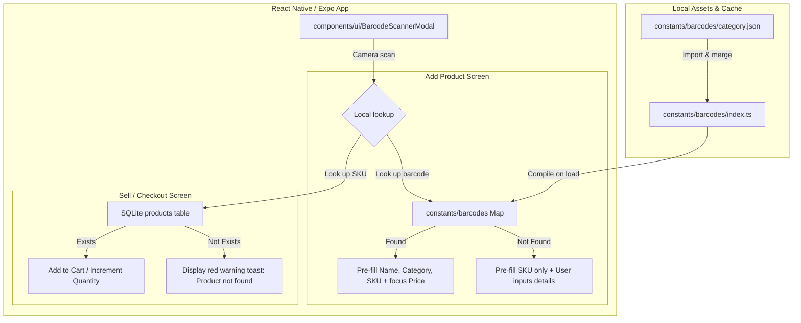

# Design Specification: Product Barcode Scanning

This document outlines the design for the camera-based product barcode scanning feature in SariSari. It provides store owners with the ability to quickly scan product barcodes using their device's camera. This serves two core workflows:
1. **Inventory Setup**: Scanning a product's barcode dynamically queries a built-in offline list of popular Filipino products to pre-populate the **Product Name** and **Category**, setting the barcode as the product's **SKU**.
2. **Sales Checkout (Counter POS)**: Scanning barcodes continuously at the counter instantly looks up and adds matching products to the checkout cart with quantity increments.

---

## 1. Overview & Objectives

SariSari is an offline-first mobile application. Barcode scanning must function entirely offline (100% local database) without dependency on external APIs (e.g. Open Food Facts) or internet connection.

### Key Objectives
- **100% Offline Product Directory**: Pre-seed a modular list of popular Filipino consumer products (Coke, Lucky Me, Rebisco, Nestlé, etc.) categorized by type, enabling instant offline auto-completion.
- **Unified Barcode & SKU Mapping**: Utilize the existing `sku` database column as the primary holder for barcodes, maintaining a simple database schema.
- **Tactile feedback**: Integrate vibration triggers (`expo-haptics`) to provide tactile scanning confirmation.
- **Seamless Registration Flow**: Allow single-scan auto-close to capture SKU values when registering items.
- **Continuous POS Checkout Flow**: Keep the camera overlay open in a dedicated full-screen overlay mode during checkout to allow scanning multiple products sequentially without manual page back-and-forth.
- **Graceful Error Handling**: Display distinct error feedback if a scanned item is not present in the store's inventory, rather than blocking the checkout flow or forcing the user into nested forms mid-sale.

---

## 2. System Architecture & Components



### Module Layout

```folder
constants/barcodes/
  beverages.json           // Common Filipino drinks (Coke, Pepsi, RC, C2, etc.)
  snacks.json              // Common snacks (Rebisco, SkyFlakes, Oishi, Chippy, etc.)
  noodles.json             // Instant noodles (Lucky Me, Payless, Nissin, etc.)
  canned-goods.json        // Canned food (555, Century Tuna, Ligo, Spam, etc.)
  index.ts                 // Aggregates JSON lists and exports lookupBarcode()

components/ui/
  BarcodeScannerModal.tsx  // Full-screen native CameraView modal wrapper with scanning target grid

components/inventory/products/add-product/ (modified)
  BasicInfoCard.tsx        // Render camera button next to SKU; trigger modal open
  useAddProductForm.ts     // Handle scanned barcode, query local catalog, write form states

components/sell/add-sales/ (modified)
  ProductSearchCatalog.tsx // Add Scan FAB or scan icon button next to search text field
  useAddSalesForm.ts       // Manage continuous camera state, lookup product SKU, trigger cart updates
```

---

## 3. Data Schemas & Types

### Offline Barcode Catalog Item Schema

Each category JSON file will store items using this standard TypeScript interface:

```typescript
export interface OfflineBarcodeItem {
  barcode: string;
  name: string;
  category: string;
}
```

Example representation (`constants/barcodes/beverages.json`):
```json
[
  { "barcode": "4800016551829", "name": "Coke Original Can 330ml", "category": "Beverages" },
  { "barcode": "4800016556831", "name": "Sprite Can 330ml", "category": "Beverages" }
]
```

### Map Compilation and Aggregator (`constants/barcodes/index.ts`)

To support $O(1)$ fast retrieval, all files are combined into a single ES6 `Map` at startup:

```typescript
import beverages from './beverages.json';
import snacks from './snacks.json';
import noodles from './noodles.json';
import cannedGoods from './canned-goods.json';

const combinedCatalogs = [
  ...beverages,
  ...snacks,
  ...noodles,
  ...cannedGoods
];

const barcodeCatalogMap = new Map<string, { name: string; category: string }>();

for (const item of combinedCatalogs) {
  barcodeCatalogMap.set(item.barcode, { name: item.name, category: item.category });
}

export function lookupOfflineBarcode(barcode: string): { name: string; category: string } | null {
  return barcodeCatalogMap.get(barcode) || null;
}
```

---

## 4. Reusable BarcodeScannerModal Component

The `<BarcodeScannerModal>` is a full-screen React Native modal utilizing the Expo SDK 54 `CameraView` component.

### Permissions Flow
1. **Camera Permissions**:
   - Queries camera authorization status via `useCameraPermissions()` from `expo-camera`.
   - If not yet requested, displays an overlay explaining why camera access is required with a "Grant Permission" button.
   - If blocked/denied, displays instructions telling the user to enable camera access in their OS System Settings.

### Layout & UI Feedback
- **Overlay View**: A translucent black outer overlay with a clear, un-obscured box in the center representing the scanner target area.
- **Pulsing Scan Line**: A red horizontal laser line inside the target container, animated using a simple `MotiView` looping translation loop.
- **Haptic Signal**: On success, invokes `expo-haptics` impact feedback:
  ```typescript
  import * as Haptics from 'expo-haptics';
  await Haptics.impactAsync(Haptics.ImpactFeedbackStyle.Medium);
  ```
- **Target Formats**: Restricts scanner callbacks specifically to consumer UPC/EAN standard barcodes:
  ```typescript
  barcodeScannerSettings={{
    barcodeTypes: ['upc-a', 'upc-e', 'ean-8', 'ean-13', 'code39', 'code128']
  }}
  ```

---

## 5. Form & Screen Integrations

### A. Add Product Integration

#### BasicInfoCard.tsx (Modified Layout)
- We will replace the text-only subtext "Scan a barcode or type a custom SKU" with an interactive **Scan SKU** camera-icon button positioned directly next to the SKU input.
- Tapping the icon opens the `<BarcodeScannerModal>`.

#### useAddProductForm.ts (Modified Logic)
- **On Scanner Success**:
  1. Capture the scanned `barcode` string.
  2. Invoke `lookupOfflineBarcode(barcode)`.
  3. Set the form field `sku` value to `barcode`.
  4. If a matching item is returned:
     - Set the form field `productName` to the matched name.
     - Set the form field `category` to the matched category.
     - Automatically focus the `price` input field, prompting the user to complete the required price configuration.
  5. If no match is found, preserve the `sku` value, leave the product name blank, and show a brief toast: *"Barcode scanned. Product details not in database; please type details manually."*
  6. Close the scanner modal.

### B. Sell / Checkout POS Integration

#### ProductSearchCatalog.tsx (Modified Layout)
- Introduce a barcode floating action button (FAB) or a search bar camera icon button.
- Tapping it triggers the `<BarcodeScannerModal>` in **continuous scan mode**.

#### useAddSalesForm.ts (Modified Logic)
- **Continuous Scan Logic**:
  - The modal stays visible across multiple successful barcode reads to support scanning a list of items sequentially.
  - **On Scanner Success**:
    1. Capture the scanned barcode (`sku`).
    2. Search the loaded `products` list for an item matching `sku`.
    3. **If Found**:
       - Increment the cart item count by calling the existing `handleAddItem(product)`.
       - Play a medium haptic vibration.
       - Display a visual on-screen banner at the bottom of the viewfinder overlay indicating *"Scanned: [Product Name] (+1)"* along with the new cart item count and running total.
       - Temporarily throttle scanner detection for 1.5 seconds for the same barcode to prevent duplicate reads of the same scan.
    4. **If Not Found**:
       - Play an error haptic pattern.
       - Display a floating toast warning: *"Product not registered in inventory (SKU: X)"*.
       - Keep the scanner active so the user can proceed scanning other items.
  - The user exits checkout scanning by clicking the **"Done"** action button.

---

## 6. Expo Configuration & Permissions (`app.json`)

To ensure native compilation on both Android and iOS works correctly, we will add the `expo-camera` plugin setup in `app.json`:

```json
{
  "expo": {
    "plugins": [
      [
        "expo-camera",
        {
          "cameraPermission": "Allow SariSari to use the device camera to scan product barcodes."
        }
      ]
    ]
  }
}
```

---

## 7. Testing & Verification Plan

1. **Hardware Verification**:
   - Run on simulator (which mocks camera output with test barcodes) to verify layout rendering and permission cards.
   - Run on real Android/iOS devices (`npx expo run:android` / `npx expo run:ios`) to verify autofocus, low-light detection, and haptic feedback.
2. **Offline Mode Verification**:
   - Enable Airplane mode on the physical device.
   - Scan a Coke/Lucky Me barcode and verify the product name and category auto-populate instantly without network delays.
3. **Database Integrity Verification**:
   - Verify that adding a scanned product correctly registers the barcode value into the `sku` column.
   - Verify that selling a scanned product correctly increments the cart and, upon submission, updates the quantity in both `products` and the audit-trail table `inventory_transactions` correctly.
