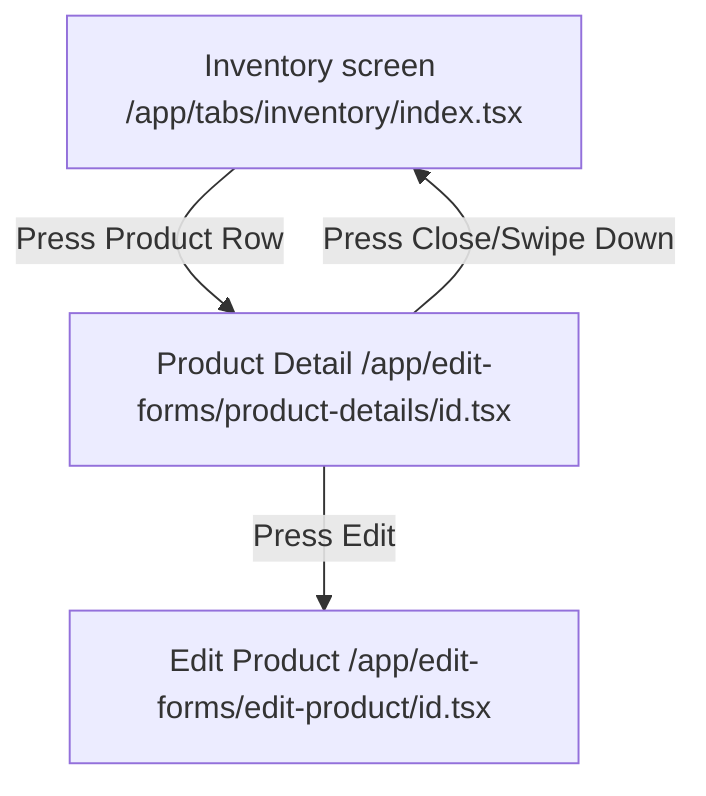

# Product Details Screen Design Spec

## 1. Overview

The **Product Details** screen provides a centralized, interactive, and informative overview of an inventory item. Tapping a product in the primary inventory catalog will open this new detailed interface instead of doing nothing or showing a generic action menu. The screen is designed as a sheet modal (`presentation: 'formSheet'`) that organizes information into three tabs: Overview, History, and Supplier.

## 2. Requirements & Success Criteria

- **Aesthetics & Feel:** High haptic feedback, beautiful card structures with distinct cinnamon and persimmon themes, and clear typography.
- **Information Architecture:** Easy access to stock levels, cost and selling pricing, markup margins, SKU/barcode identification, transaction ledger entries, and supplier data.
- **Actions:** Direct triggers to restock, adjust stock quantities, mark items as damaged, edit the product, or delete the product.
- **Hard Offline-First:** Zero network queries, instant tab transitions, and local calculations.
- **Financial Integrity:** Strict adherence to integer pesos representation using utility formatters.

## 3. Navigation & Screen Flow

The route will be located at:
`app/(edit-forms)/product-details/[productId].tsx`



### Route Config

Inside `app/(edit-forms)/_layout.tsx`, the route will automatically inherit `presentation: 'formSheet'` and `contentStyle: { backgroundColor: '#FAF7F0' }`.

## 4. UI Component Layout (Tabbed Detail Dashboard)

### 4.1 Header Bar

- **Close Button:** Custom close button (`✕` icon or text) on the top-left leading to `router.back()`.
- **Title:** Center-aligned title displaying "Product Details".
- **Edit Button:** Text button "Edit" on the top-right triggering `router.push('/(edit-forms)/edit-product/[id]')`.

### 4.2 Underlined Flat Text Tab Bar

- Uses a simple horizontal row containing three text selections: `Overview`, `History`, and `Supplier`.
- Active state: Text becomes bold ink-900, with a sliding border bar `h-[2px] bg-persimmon-500` positioned directly beneath.
- Haptic vibration triggers on switching tabs.

### 4.3 Tab Contents

#### Tab 1: Overview

1.  **Product Card:** Displays product image (or a dynamic monogram letter avatar), name, SKU, and barcode. Features a colored Stock Badge (danger/warning if below `LOW_STOCK_THRESHOLD`, success if in normal range).
2.  **Financial Grid:** A card grid dividing financial metrics:
    - _Selling Price:_ ₱ price (using `formatPesos`).
    - _Cost Price:_ ₱ cost price (if defined; otherwise displays `"—"`).
    - _Markup:_ ₱ markup amount (if cost price is defined).
    - _Margin:_ markup % (if cost price is defined).
3.  **Quick Actions Row:** Flat buttons styled with light cream backgrounds and clear icons/borders:
    - _Restock:_ Invokes the quick replenishment action.
    - _Adjust:_ Triggers manual inventory adjustments.
    - _Damaged:_ Records damaged stock losses.

#### Tab 2: History (Ledger Timeline)

- Integrates a simplified timeline listing of recent stock movements.
- Retrieves transactions from the query layer, displaying:
  - Status change: `-1` (Sale), `+10` (Restock), `-2` (Damaged) in appropriate green/red colors.
  - Timestamp: Formatted relative time (e.g., `Today, 10:15 AM`, `Yesterday`).
  - Notes: Short reason or origin (e.g., `POS Sale`, `Manual Adjust`).

#### Tab 3: Supplier

- Displays linked supplier card:
  - Supplier name.
  - Contact phone number with a button to dial/message directly.
  - Supplier notes.
- If no supplier is linked, renders a clean empty state graphic stating `"No Supplier Linked"` with a quick shortcut to edit the product to attach one.

## 5. Technical Layer & Hook Integration

All data queries go through TanStack Query hooks:

1.  **Product Query:**
    ```ts
    const { useGetProduct } = useProducts();
    const productQuery = useGetProduct(parsedProductId);
    ```
2.  **Transactions Query:**
    ```ts
    const transactionsQuery =
      useInventoryTransactionsByProduct(parsedProductId);
    ```
3.  **Supplier Query:**
    ```ts
    const { useGetSupplier } = useSuppliers();
    const supplierQuery = useGetSupplier(product?.supplier_id);
    ```
    _Enabled only if `product?.supplier_id` is present._

## 6. Implementation Checklist & Guardrails

- **Money Representation:** Selling price and cost prices must use `formatPesos` for conversion and display. Do not perform float calculations directly on money fields.
- **Offline-First:** Loading states must use cached data instantly.
- **Transactions Handling:** All actions (adjusting stock, logging restocks/damages) must run via transactions to ensure the ledger integrity remains unified.
