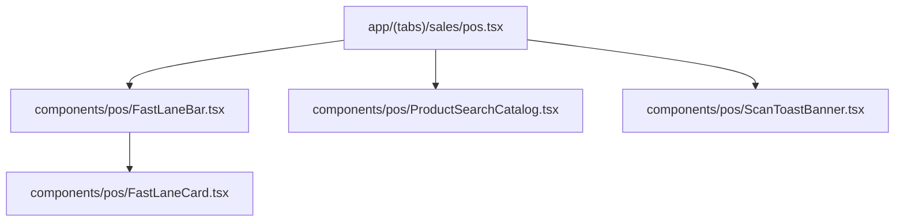

# Technical Design Specification: POS Fast Lane (Mabilisang Pag-checkout sa POS)

> **Date**: 2026-08-05  
> **Status**: Approved  
> **Feature Doc**: `docs/features/01-pos-fast-lane.md`

---

## 1. Executive Summary

During peak rush hours, sari-sari store cashiers race against long customer lines. Currently, the POS catalog (`app/(tabs)/sales/pos.tsx`) lists all products uniformly, forcing cashiers to repeatedly search or scroll for the same top 8-15 daily items.

The **POS Fast Lane** feature introduces a high-speed pinned surface above the catalog featuring:

1. **Favorites Surface**: User-favorited items (`is_favorite = 1`).
2. **Top-Sold Strip**: Top selling items from the previous 14 days based on `sale_items`.
3. **Quick Quantity Action Chips**: One-tap quantity chips (`+1`, `+2`, `+5`, `+12`) per product card to bypass manual quantity selection.
4. **Barcode Scanning Integration**: Direct +1 add-to-cart with visual toast feedback.

---

## 2. Architecture & Data Model

### 2.1 SQLite Schema & Migration (Version 14)

A new database migration is added to `database/migrations.ts` targeting `user_version < 14`:

```typescript
// Migration block for version 14 in database/migrations.ts
if (currentVersion < 14) {
  console.log('Running migration to version 14 (POS Fast Lane)...');
  await db.withTransactionAsync(async () => {
    // 1. Add columns to products table if missing
    const productCols = await db.getAllAsync<{ name: string }>(
      'PRAGMA table_info(products)',
    );
    const hasFavorite = productCols.some((c) => c.name === 'is_favorite');
    const hasLastSold = productCols.some((c) => c.name === 'last_sold_at');

    if (!hasFavorite) {
      await db.execAsync(
        'ALTER TABLE products ADD COLUMN is_favorite INTEGER NOT NULL DEFAULT 0;',
      );
    }
    if (!hasLastSold) {
      await db.execAsync('ALTER TABLE products ADD COLUMN last_sold_at TEXT;');
    }

    // 2. Create performance indexes
    await db.execAsync(
      'CREATE INDEX IF NOT EXISTS idx_products_favorite ON products(is_favorite);',
    );
    await db.execAsync(
      'CREATE INDEX IF NOT EXISTS idx_products_last_sold ON products(last_sold_at);',
    );

    await db.execAsync('PRAGMA user_version = 14;');
  });
  console.log('Database migrated to version 14.');
}
```

### 2.2 Database Query Helper: `getFastLaneProducts({ limit })`

File: `database/products.ts`

```typescript
export interface FastLaneProduct extends Product {
  is_favorite: number;
  last_sold_at?: string | null;
  units_sold_14d?: number;
}

export async function getFastLaneProducts({
  limit = 15,
}: { limit?: number } = {}): Promise<FastLaneProduct[]> {
  // Query returns favorites first, followed by top 14-day sold products, deduplicated by product ID.
  const sql = `
    WITH favorite_items AS (
      SELECT p.*, 1 AS is_fav_priority, 0 AS units_sold_14d
      FROM products p
      WHERE p.is_favorite = 1
    ),
    top_sold_items AS (
      SELECT p.*, 0 AS is_fav_priority, SUM(si.quantity) AS units_sold_14d
      FROM products p
      JOIN sale_items si ON si.product_id = p.id
      JOIN sales s ON s.id = si.sale_id
      WHERE s.timestamp >= datetime('now', '-14 days')
        AND p.is_favorite = 0
      GROUP BY p.id
      ORDER BY units_sold_14d DESC
    )
    SELECT * FROM (
      SELECT * FROM favorite_items
      UNION ALL
      SELECT * FROM top_sold_items
    )
    LIMIT ?;
  `;
  return await db.getAllAsync<FastLaneProduct>(sql, [limit]);
}

export async function toggleProductFavorite(
  productId: number,
  isFavorite: boolean,
): Promise<void> {
  await db.runAsync('UPDATE products SET is_favorite = ? WHERE id = ?;', [
    isFavorite ? 1 : 0,
    productId,
  ]);
}
```

---

## 3. UI Component Architecture



### 3.1 `FastLaneBar` (`components/pos/FastLaneBar.tsx`)

- Rendered above the search input in `pos.tsx`.
- Uses a horizontal `ScrollView` with `showsHorizontalScrollIndicator={false}`.
- Renders `FastLaneCard` for each product returned by `useFastLaneProducts()`.
- Pinned at top even when text is typed in search bar.

### 3.2 `FastLaneCard` (`components/pos/FastLaneCard.tsx`)

- Card layout displaying product name, price (in ₱), and favorite star indicator.
- Contains quick quantity action chips: `+1`, `+2`, `+5`, `+12`.
- Tapping a chip calls `onAddToCart(product, quantity)`.
- Star button allows toggling favorite status directly from the card.

### 3.3 `ProductSearchCatalog` Star Toggle (`components/pos/ProductSearchCatalog.tsx`)

- Each product row in the catalog includes a star toggle icon.
- Allows cashiers to star/unstar any product in the main catalog view.

### 3.4 `ScanToastBanner` (`components/pos/ScanToastBanner.tsx`)

- Floating top banner for barcode scan feedback.
- Slides down for 1.5s when a barcode scan resolves:
  - **Success**: `"✓ Added 1x Coca-Cola 1.5L"` (Green)
  - **Not Found**: `"❌ Barcode not found: 48000012345"` (Red)

---

## 4. Hooks & Data Flow

### 4.1 `useFastLaneProducts()` (`hooks/useProducts.tsx`)

```typescript
export function useFastLaneProducts() {
  return useQuery({
    queryKey: ['fastLaneProducts'],
    queryFn: () => getFastLaneProducts({ limit: 15 }),
  });
}
```

### 4.2 `useToggleFavorite()` (`hooks/useProducts.tsx`)

```typescript
export function useToggleFavorite() {
  const queryClient = useQueryClient();
  return useMutation({
    mutationFn: ({
      productId,
      isFavorite,
    }: {
      productId: number;
      isFavorite: boolean;
    }) => toggleProductFavorite(productId, isFavorite),
    onSuccess: () => {
      queryClient.invalidateQueries({ queryKey: ['fastLaneProducts'] });
      queryClient.invalidateQueries({ queryKey: ['products'] });
    },
  });
}
```

---

## 5. Non-Functional Requirements & Constraints

1. **Offline-First**: All reads, favorite updates, and barcode lookups execute against local SQLite database.
2. **Zero Placeholders**: Full production TypeScript implementations without placeholder code.
3. **Integer Pesos Standard**: Currency formatting enforces project standard integer pesos format.

---

## 6. Verification Plan

1. **Type Check**: Execute `npx tsc --noEmit`.
2. **Migration Check**: Launch app and confirm `user_version` upgrades to 14.
3. **Behavioral Test**:
   - Star item in catalog ➔ verifies appearance in Fast Lane bar.
   - Tap `+1`, `+2`, `+5`, `+12` chips ➔ verifies cart additions.
   - Scan barcode ➔ verifies +1 direct cart addition and toast feedback banner.
