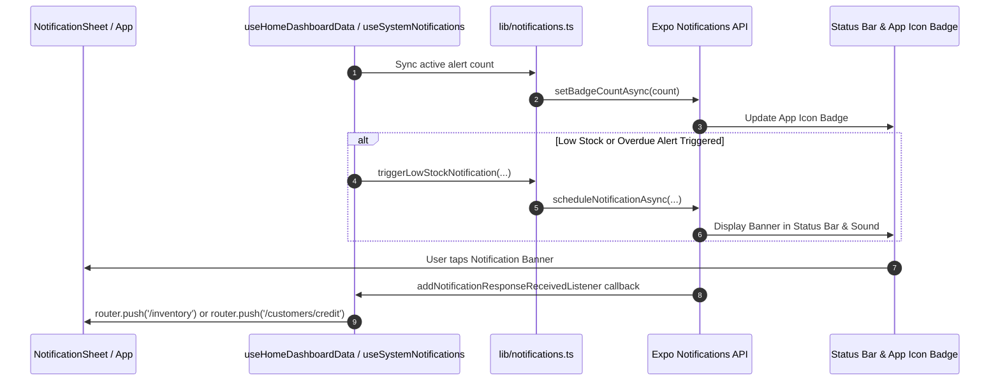

# Spec: Notification Sheet Infinite Scroll & Expo System Notifications

## 1. Overview

This specification details two connected improvements for SariSari:
1. **NotificationSheet Infinite / Scrollable List**: Refactoring `NotificationSheet.tsx` to remove the hardcoded `MAX_ALERTS = 3` limit and static `View` mapping, replacing it with a virtualized `FlatList` that seamlessly scrolls through all store alerts while supporting gesture swipe-to-dismiss.
2. **System Notifications (Expo Notifications)**: Integrating local device system notifications, status bar alerts, app icon badges, and deep-linking navigation when store alerts occur (low stock items, overdue suki debt, unclosed cash session).

---

## 2. NotificationSheet Refactoring (`components/layout/NotificationSheet.tsx`)

### 2.1 Current Limitations
- `MAX_ALERTS = 3` truncates the alert list (`alerts.slice(0, 3)`).
- Rendered inside a fixed `View` container without scrolling. When store owners have > 3 alerts (e.g., 5 low stock products and 2 overdue customers), remaining items are inaccessible inside the sheet.

### 2.2 Design & UI Specification
- **Virtualized Scrolling**: Replace static `View.map` with `FlatList` from `react-native-gesture-handler` (or React Native `FlatList` configured with gesture cooperation).
- **Infinite / Full List Capability**: Remove `MAX_ALERTS` truncation so all items in `alerts: DynamicHomeAlert[]` are rendered efficiently.
- **Fixed Header & Footer**: Keep the top drag handle + Header (`Notifications`, total alert count, close `✕` button) and bottom CTA (`See all alerts`) fixed, with the list scrolling in between.
- **Max Container Bounding**: Bounded sheet height (`maxHeight: SCREEN_HEIGHT * 0.65`).
- **Gesture Interaction**:
  - Dragging down on the top handle or swiping down when `FlatList` is scrolled to the top (`scrollY === 0`) initiates the sheet dismiss gesture.
  - Normal downward scrolling inside the list scrolls items without triggering premature sheet dismissal.
- **Empty State**: Render explicit empty state when `alerts.length === 0` ("Store is operating smoothly. No alerts right now.").

---

## 3. System Notifications via Expo Notifications

### 3.1 Dependencies & Configuration
- **Package**: `expo-notifications` (version `~0.32.12` already in `package.json` and `app.json`).
- **App Plugin**: `expo-notifications` configured in `app.json` for Android icons, colors, and iOS permissions.

### 3.2 System Utilities (`lib/notifications.ts`)
Create a dedicated module for managing device notifications:
1. **Permissions**:
   - `requestNotificationPermissions()`: Asks user for notification permission (`Notifications.requestPermissionsAsync`).
   - `getNotificationPermissionStatus()`: Checks current permission state.
2. **Android Notification Channels**:
   - Set up custom high-priority channels on Android:
     - `low-stock-channel`: High importance, badge enabled, custom vibration/sound for urgent inventory alerts.
     - `overdue-debt-channel`: Default/high importance for suki payment collection reminders.
     - `daily-summary-channel`: Default importance for end-of-day store summary.
3. **Foreground Presentation**:
   - Configure `Notifications.setNotificationHandler` so notifications trigger status bar banners, alert sounds, and badge increments even while the app is active in foreground.
4. **App Icon Badge Synchronization**:
   - `updateAppIconBadge(count: number)`: Invokes `Notifications.setBadgeCountAsync(count)` to update app badge count on iOS & Android launchers.
5. **Local Notification Scheduling**:
   - `triggerLowStockNotification(productName: string, quantity: number)`: Triggers immediate status bar alert when item stock drops to critical levels.
   - `triggerOverdueDebtNotification(customerName: string, amountFormatted: string)`: Triggers status bar alert for overdue customer credit.

### 3.3 System Notification Synchronization Hook (`hooks/useSystemNotifications.ts`)
Create a dedicated React hook to bridge store alerts with system notifications:
1. **Automatic Badge Updates**:
   - Listens to `useHomeDashboardData` or queries SQLite directly for total active alert count (`lowStockCount + overdueCount`).
   - Calls `updateAppIconBadge(totalAlerts)` on state change.
2. **Notification Response Listener**:
   - Adds `Notifications.addNotificationResponseReceivedListener` on app mount.
   - Handles deep linking navigation via `expo-router`:
     - Tapping a low stock alert navigates to `/(tabs)/inventory`.
     - Tapping an overdue debt alert navigates to `/(tabs)/customers/credit`.
3. **User Preference Check**:
   - Reads notification enable/disable setting from Zustand or local storage before scheduling system alerts.

### 3.4 Settings Screen Integration (`app/(tabs)/settings/index.tsx`)
- Add a toggle switch in Settings: **"Enable System Notifications"** (Defaults to enabled).
- Toggling ON prompts permission request if not granted.
- Toggling OFF clears active badges (`Notifications.setBadgeCountAsync(0)`) and cancels scheduled alerts.

---

## 4. Data Flow Architecture

---

## 5. Verification & Quality Plan

1. **Type Checking & Linting**:
   - Run `npm run typecheck` and `npm lint` to ensure strict TypeScript compliance.
2. **Unit & Integration Tests**:
   - Add unit tests in `tests/lib/notifications.test.ts` for `lib/notifications.ts` functions (mocking `expo-notifications`).
   - Test `NotificationSheet` rendering with zero, 3, and 15+ mock alert items.
3. **Verification Command**:
   - Run `npm verify` to execute type checks and full test suite.
