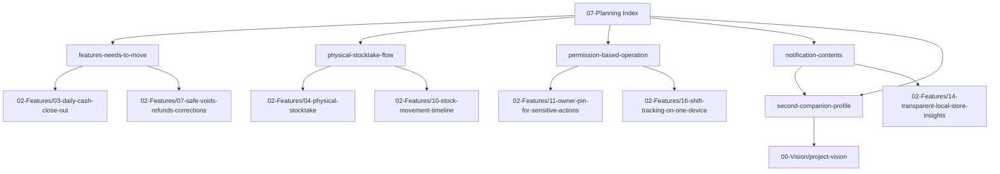

# 07-Planning Index

Welcome to the **Planning & Tactical Execution Hub** for SariSari. This directory houses short-to-medium term tactical planning documents, feature relocation plans, operational workflow breakdowns, and companion/notification strategies.

---

## 🗺️ Quick Links & Navigation

- **Core Vision**: [[00-Vision/project-vision|Project Vision]]
- **Master Roadmap**: [[01-Roadmap/project-roadmap|Project Roadmap]] & [[01-Roadmap/feature-implementation-status-and-ia|Feature Implementation Status & IA]]
- **Feature Specs**: [[features|02-Features Catalog]]
- **Resources & Templates**: [[resources|Resources Index]]

---

## 📋 Active Planning Documents

### 0. Feature Roadmap & Next Priorities

- **[[07-Planning/next-feature-recommendations|Next Feature Recommendations (Post-Feature #7)]]**
  - Strategic feature breakdown and implementation recommendations following Feature #7 release.
  - Linked Specs: [[02-Features/07-safe-voids-refunds-corrections|07-Safe Voids, Refunds & Corrections]], [[02-Features/11-owner-pin-for-sensitive-actions|11-Owner PIN for Sensitive Actions]], [[02-Features/08-supplier-delivery-receiving|08-Supplier Delivery Receiving]]

### 1. Information Architecture & Navigation

- **[[07-Planning/features-needs-to-move|Features Needed to Move in Respective Screen Routes]]**
  - Repurposing features currently on the Home/Today screen to dedicated tab routes.
  - Linked Specs: [[02-Features/03-daily-cash-close-out|03-Daily Cash Close Out]], [[02-Features/07-safe-voids-refunds-corrections|07-Safe Voids, Refunds & Corrections]]

### 2. Operational & Inventory Workflows

- **[[07-Planning/physical-stocktake-flow|Physical Stocktake Flow]]**
  - Step-by-step counting workflow, variance reviews, schedule notifications, and guardrails.
  - Linked Specs: [[02-Features/04-physical-stocktake|04-Physical Stocktake]], [[02-Features/10-stock-movement-timeline|10-Stock Movement Timeline]], [[02-Features/08-supplier-delivery-receiving|08-Supplier Delivery Receiving]]

### 3. Security & Access Control

- **[[07-Planning/permission-based-operation|Permission Based Operation (Access System)]]**
  - Owner vs. Staff access permissions matrix and PIN gatekeeper rules.
  - Linked Specs: [[02-Features/11-owner-pin-for-sensitive-actions|11-Owner PIN for Sensitive Actions]], [[02-Features/16-shift-tracking-on-one-device|16-Shift Tracking on One Device]]

### 4. Smart Notifications & Store Companion Persona

- **[[07-Planning/notification-contents|Future Push Notification Contents]]**
  - Categorized push notification copy and trigger priorities (Inventory Intelligence, Utang Reminders, Daily Companion).
  - Linked Specs: [[02-Features/14-transparent-local-store-insights|14-Transparent Local Store Insights]]
- **[[07-Planning/second-companion-profile|Second Companion Profile]]**
  - Specification of the sari-sari store virtual companion / assistant persona.
  - Connected Notes: [[00-Vision/project-vision|Project Vision]], [[07-Planning/notification-contents|Notification Contents]]

---

## 🛠️ Templates & Guidelines

- **[[07-Planning/planning-template|Planning Template]]**: Standardized format for sprint plans, Q goals, and work breakdowns.

---

## 🔄 Bidirectional Relationships Graph

